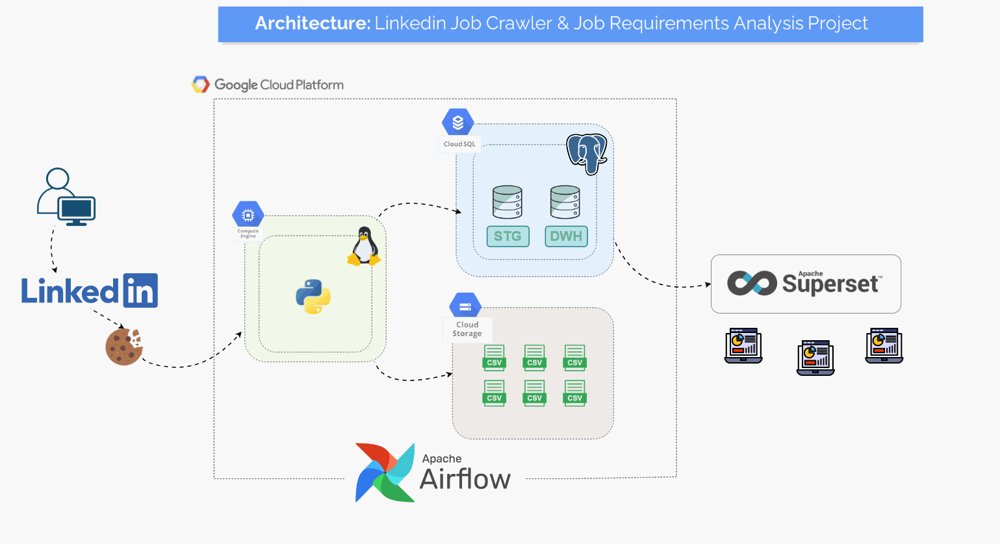
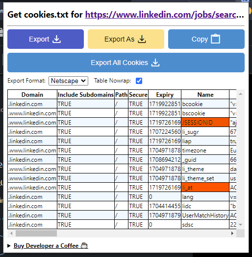

# LINKEDIN JOB CRAWLER

Repoyu kaydetmek için:

`git clone https://github.com/cihanerdo/linkedin_job_crawler.git`

## Cookie Nasıl Alınır?

- linkedin.com'da oturum açın
- [Get cookies.txt LOCALLY](https://chrome.google.com/webstore/detail/get-cookiestxt-locally/cclelndahbckbenkjhflpdbgdldlbecc/related) eklentisini indirin.
- Çerezi indirin ve configs klasörüne kaydedin. (indirdiğiniz dosyaya `cookie.txt` ismini verin) 

## Veritabanı Bağlantısı

Veritabanı bağlantısı için gerekli bilgileri .env dosyasına girin.

`DB_USERNAME="your_username"`

`DB_PASSWORD=your_password`

`DB_HOST_IP="your_ip"`

`DB_NAME="your_database_name"`

## Install Requirements.txt 

`pip install -r requirements.txt`

 ## Nasıl Kullanılır

**Full run modunda çalıştırmak için:**

`python main.py -j "job_title" -l "location"`

**Debug modunda çalıştırmak için:**

 `python main.py -j "job_title" -l "location" -d`

## Destekleklenen Ülkeler

Desteklenen ülke ve geoid’ler configs/[conf.py](http://conf.py) dosyasında belirtilmiştir. 

Farklı ülke eklemek için ülke ismi ve geoid bilgisini conf.py içerisinde geoid_dict’e ekleyebilirsiniz.  

[LinkedIn Jobs](https://www.linkedin.com/jobs/) sekmesinde istenilen ülke aranarak geoid bilgisine aşağıdaki şekilde ulaşılabilir.

**Sample URL:** `https://www.linkedin.com/jobs/search/ currentJobId=3797992840&**geoId=101282230**&location=Germany`

| Country | Geoid |
| --- | --- |
| Turkey | 102105699 |
| Germany | 101282230 |
| Switzerland | 106693272 |
| USA | 103644278 |
| France | 105015875 |
| Canada | 101174742 |
| Denmark | 104514075 |
| United Kingdom | 101165590 |
| ... | … |

## Airflow

Airflow kurulumu için aşağıdaki adımları uygulayın.

`mkdir -p ./dags ./logs ./plugins ./config`

`echo -e "AIRFLOW_UID=$(id -u)" > .env`

`docker compose up —build -d`

Kurulum bittikten sonra http://localhost:8080 adresinden Airflow UI’ya bağlantı sağlayabilirsiniz.

## Proje Örneği

`python main.py -j “data analyst” -l “turkey” -d`

**Türkiye’de açılmış Data Analyst ilanları.**

**Türkiye’de açılmış Data Analyst ilanlarının detayları**

**İş ilanları hakkında genel bilgiler** 

**İş İlanlarının detaylı tablosu**

## Superset

****************Data Engineer ilanlarının sonucu****************

**************************************************************************************Amerika’da açılmış Data Engineer ilanlarının sonucu**************************************************************************************

******************************************************************************Entry Level Data Scientist İlanları******************************************************************************

